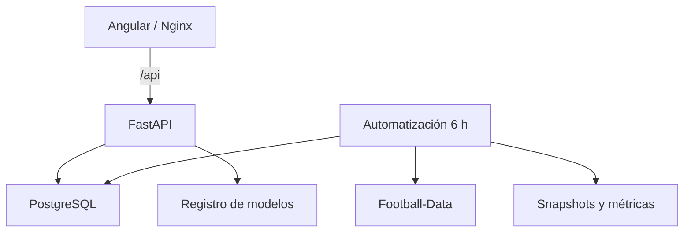

# Arquitectura técnica

## Visión general

## Componentes

| Componente | Responsabilidad |
|---|---|
| Angular 20 | Experiencia web, filtros y visualización |
| Nginx | Archivos estáticos, proxy `/api` y encabezados defensivos |
| FastAPI | Contratos REST, validación, consultas y operaciones controladas |
| PostgreSQL 17 | Estado operativo, historial, evaluaciones y gobierno de modelos |
| Automatización | Consulta Football-Data y aplica actualizaciones idempotentes |
| Pipeline ML | Variables temporales, ensembles, goles y simulación Monte Carlo |

## Flujo de datos

1. Football-Data publica resultados y cuotas de LaLiga.
2. El servicio `automation` consulta la fuente cada seis horas.
3. Los registros se validan contra los 380 identificadores del calendario.
4. La actualización se ejecuta de forma transaccional y conserva snapshots.
5. Los pronósticos prepartido permanecen inmutables.
6. Al finalizar un partido se calculan Accuracy, Log Loss y Brier Score.
7. El registro champion–challenger usa resultados reales para comparar
   versiones, sin promoción automática.
8. FastAPI sirve el estado a Angular mediante `/api`.

## Límites de confianza

- El navegador solo accede al servicio web.
- Nginx reenvía solicitudes de lectura a FastAPI por la red interna.
- Los endpoints de escritura exigen una clave administrativa en producción.
- PostgreSQL no publica un puerto en la composición de producción.
- La automatización comparte almacenamiento persistente con la API para datos,
  snapshots y el modelo activo.

## Persistencia

| Ruta o volumen | Datos |
|---|---|
| `laliga_postgres_data` | Tablas PostgreSQL |
| `data/incoming/` | Resultados y cuotas validados |
| `data/processed/` | Estado canónico de la temporada |
| `reports/` | Métricas, tablas y artefactos ML |
| `snapshots/` | Fotografías auditables por actualización |
| `models/` | Especificación del modelo champion activo |

## Decisiones metodológicas

- Toda variable de rendimiento utiliza información anterior al partido.
- La selección de modelos se hace con división temporal, no aleatoria.
- Las predicciones históricas no se sobrescriben.
- Las 50,000 simulaciones fijan los partidos ya disputados.
- Un challenger necesita 80 partidos y 8 jornadas como mínimo.
- La promoción del modelo es manual, explícita y auditable.
